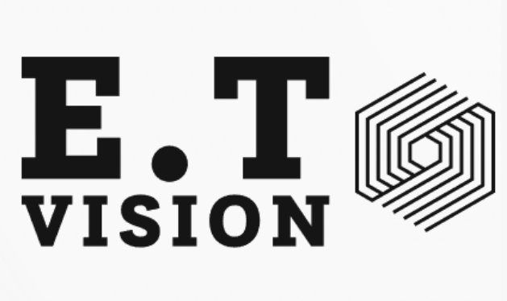

# Projet de Comparaison d'Éléments avec YOLO et OCR (Optical Character Recognition)




## Description
Ce projet consiste en plusieurs scripts Python permettant de réaliser des comparaisons entre deux éléments en utilisant les technologies YOLO (You Only Look Once) et OCR (Optical Character Recognition) avec PyTesseract. L'acquisition d'images est effectuée à l'aide d'une caméra Basler, tandis que l'interface utilisateur est développée en utilisant PyQt6.

## Prérequis
Assurez-vous d'avoir installé les bibliothèques nécessaires avant d'exécuter le code. Vous pouvez les installer en utilisant la commande suivante dans un environnement virtuel Python (https://www.docstring.fr/glossaire/environnement-virtuel/) :
```bash
pip install -r requirements.txt
```

## Lancement du Programme
Après avoir installé les dépendances, lancez le code principal `main.py` pour démarrer le programme. Assurez-vous que la caméra Basler est connectée avant d'exécuter le code. L'interface utilisateur se lancera automatiquement, et les différents scripts seront enchaînés pour effectuer les opérations de comparaison. Si la caméra est connectée, le processus d'acquisition d'image commencera également.

## Notes Supplémentaires
- Assurez-vous de consulter les vidéos explicatives disponibles dans le Drive `E.T Vision/` (en demandant l'accès) pour une compréhension approfondie du fonctionnement de chaque script.
- Des notes détaillées sont fournies dans chaque fichier de code pour expliquer la logique et la séquence des opérations.

## Questions
Pour toute question ou doute, vous pouvez me contacter par mail : `thomas.eude3@gmail.com`.


```

Cette section supplémentaire fournit des informations sur la manière de lancer le programme principal et souligne l'importance de la caméra Basler pour le bon fonctionnement du programme. De plus, elle dirige l'utilisateur vers des ressources complémentaires telles que des vidéos explicatives et des notes détaillées dans chaque fichier de code.